  

### 👨‍💻 About Me
I am a passionate **Full-Stack Developer** dedicated to building clean, functional, and user-friendly applications. I enjoy the process of turning a complex problem into a simple, elegant piece of code. 

- 🔭 **Currently working on:** Enhancing my skills in modern web frameworks and cloud technologies.
- 🌱 **Learning:** Advanced Backend Architecture and System Design.
- 👯 **Looking to collaborate on:** Open-source projects and innovative web applications.
- 💬 **Ask me about:** React, Node.js, or why I love clean code.

---

## 🛠 Tech Stack

### 🌐 Frontend
    

### ⚙️ Backend & Database
    

### 🔧 Tools & Platforms
   

---

### 📊 GitHub Stats

---

### 📫 Let's Connect!
- **LinkedIn:** [alok-kumar-a980a9295](https://www.linkedin.com/in/alok-kumar-a980a9295)
- **Portfolio:** [Coming Soon]
